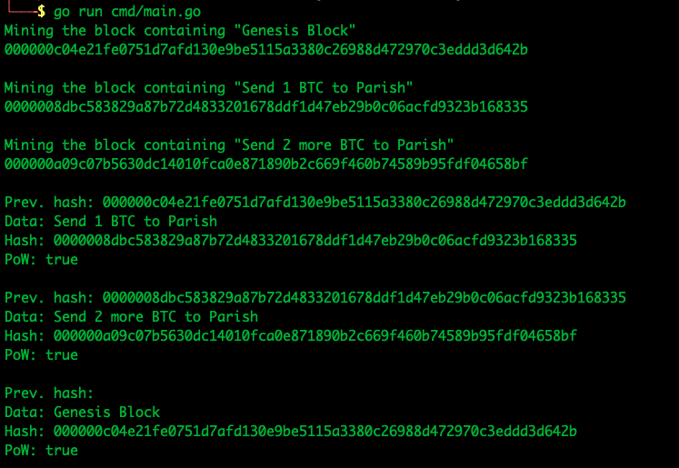

# Blockchaingo
This is a simple project with the aim of learning the technology that is blockchain.

## Chapter-2
We add proof-of-work and validate it.

### Running the program
Ensure you have golang installed and setup and follow the steps below to run the main binary.
- cd cmd
- go run main.go

You should see the below output:
